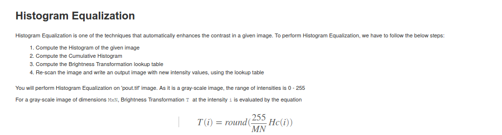
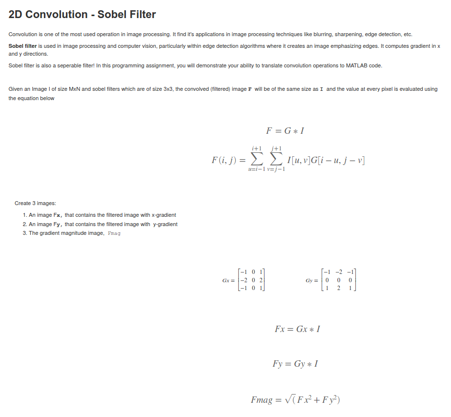
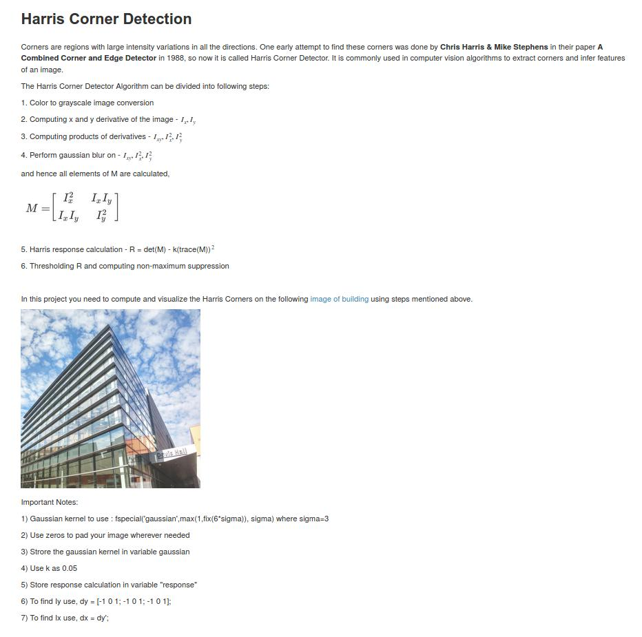
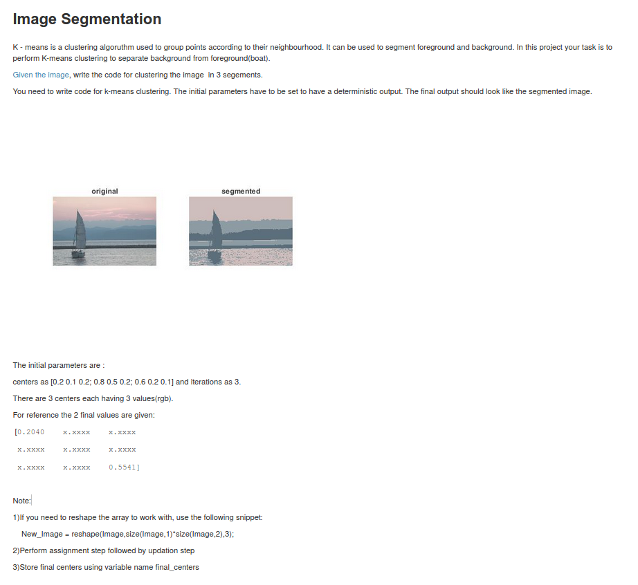

# Image-Processing-Features-Segmentation
Image Processing, Features &amp; Segmentation

## 1- Histogram Equalization ##

## 2- 2D_Convolution_Sobel Filter ##

## 3- Harris Corner Detection ##

## 4- Image Segmentation (K_means) ##

